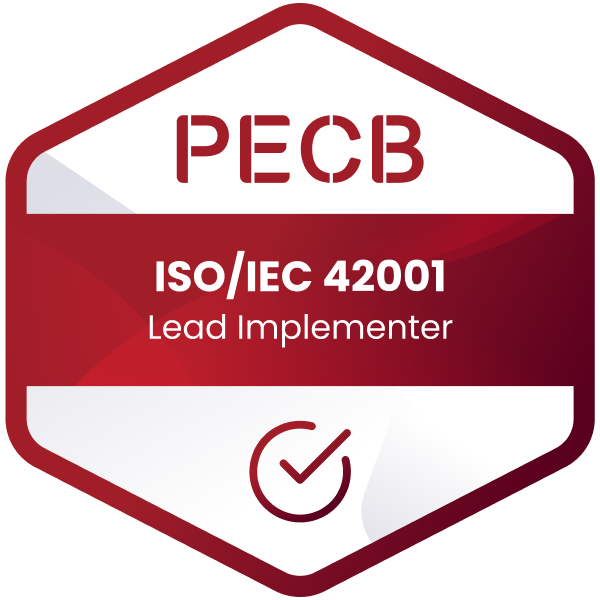

# 👋 Hi, I'm Michael van den Berg

Head of Digital Strategy & Development focusing on digital strategy, AI platforms, enterprise architecture and technology governance.

My role combines **strategy, architecture and engineering**:  
I shape digital and AI strategy, design enterprise platforms and governance structures, and stay hands-on with technology through prototyping and open-source contributions.

---

## 🏆 Certifications

  
  
  

### In Progress
- **IAPP – AIGP (AI Governance Professional)**
- **ITIL 5 – Bridge Course**

---

## 🔭 Current Focus

My current work centres around building sustainable digital and AI capabilities within organisations.

- Designing and operating a **central organisational AI platform**
- Establishing **AI governance frameworks**, including risk assessment, lifecycle management and compliance controls
- Defining **enterprise architecture principles** for secure and scalable IT
- Supporting **digital transformation and technology modernisation**

---

## 🧑‍💼 Leadership Responsibilities

I lead a cross-functional team responsible for:

- Requirements engineering and demand management  
- GIS systems, ETL pipelines and business intelligence  
- Enterprise architecture practice and EAM (LeanIX)  
- Solution architecture and technology evaluation  
- Security, quality and compliance across the IT portfolio  

---

## 🧠 Strategy – Architecture – Engineering

My work typically operates across three layers:

**Strategy**  
Shaping digital and AI strategy and aligning technology initiatives with organisational goals.

**Architecture**  
Designing enterprise platforms, governance models and system landscapes.

**Engineering**  
Building prototypes, exploring technologies and contributing to open-source projects to stay close to real operational constraints.

---

## 🧰 Technology Landscape

### AI & Automation
- vLLM deployment of small to medium open-source LLMs  
- Custom model training & LoRA/adapter fine-tuning  
- RAG systems and LLM integration patterns  
- Python-based automation and integration  
- Docker/Kubernetes-based AI services

### Architecture & Governance
- Digital Strategy & Roadmap
- Enterprise Architecture with LeanIX  
- ITIL 4 practices  
- AI governance & risk assessment  
- ISO/IEC 42001 (AI Management Systems)

### Languages
- Python  
- PowerShell & Bash  
- Java (historical)

---

## 🌐 Open Source Interests

I occasionally contribute to projects in the AI and data governance ecosystem,
for example around PII detection, LLM guardrails and secure AI platform patterns.

---

## 📫 Contact

- **LinkedIn:** https://www.linkedin.com/in/michael--van-den-berg/  
- **GitHub:** https://github.com/MvdB  

---

> _“Digital transformation requires clarity, governance and purposeful innovation.”_
